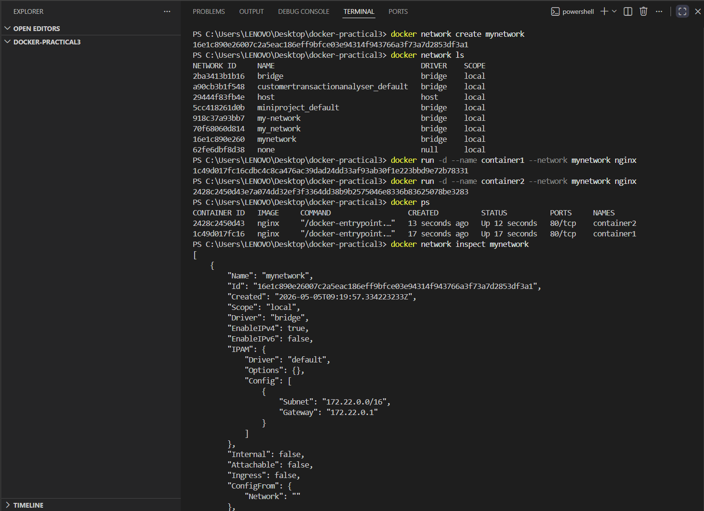
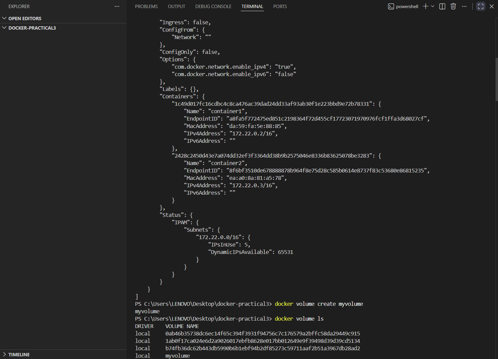
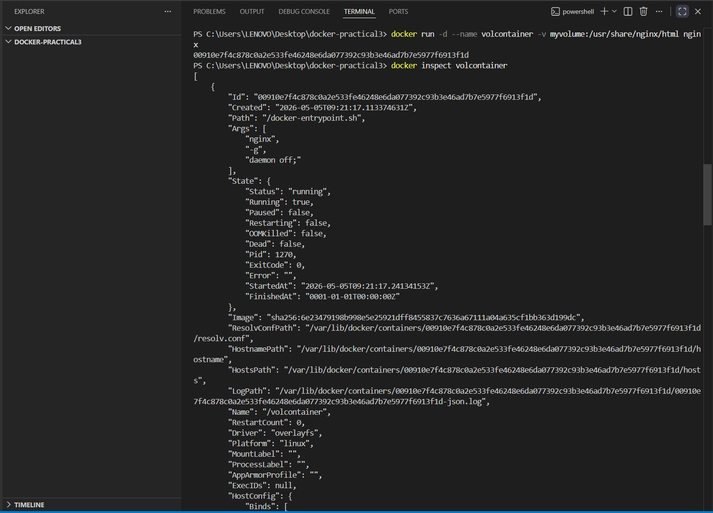

# 🔧 Practical 3 – Docker Networking and Volumes

---

## 🎯 Objective

To understand Docker networking and persistent storage using custom networks and volumes.

---

## 🧠 Concepts Covered

* Docker Networks
* Container Communication
* Docker Volumes
* Persistent Data Storage

---

## 🧪 Commands Used

### 🔹 Create a Custom Network

```bash
docker network create mynetwork
```

---

### 🔹 List Networks

```bash
docker network ls
```

---

### 🔹 Run First Container in Network

```bash
docker run -d --name container1 --network mynetwork nginx
```

---

### 🔹 Run Second Container in Network

```bash
docker run -d --name container2 --network mynetwork nginx
```

---

### 🔹 Check Running Containers

```bash
docker ps
```

---

### 🔹 Inspect Network

```bash
docker network inspect mynetwork
```

---

### 🔹 Create Volume

```bash
docker volume create myvolume
```

---

### 🔹 List Volumes

```bash
docker volume ls
```

---

### 🔹 Run Container with Volume

```bash
docker run -d --name volcontainer -v myvolume:/usr/share/nginx/html nginx
```

---

### 🔹 Inspect Container (Volume Details)

```bash
docker inspect volcontainer
```

---

## 📷 Execution Screenshots

### 1️⃣ Docker Network List & Running Containers



---

### 2️⃣  Network Inspection & Docker Volume List



---

### 3️⃣ Volume Mounted Container Inspection



---


## 📌 Expected Output

* Custom Docker network created successfully
* Containers connected within the same network
* Network inspection shows container details
* Volume created and mounted successfully
* Data persistence enabled through volume

---

## 🧠 Conclusion

Docker networking enables communication between containers within an isolated environment. Docker volumes provide persistent storage, ensuring that data remains intact even after containers are stopped or removed. These features are essential for building scalable and reliable containerized applications.

---


