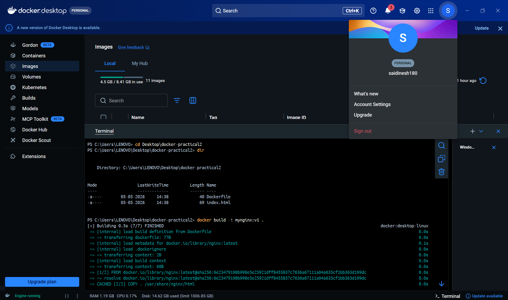
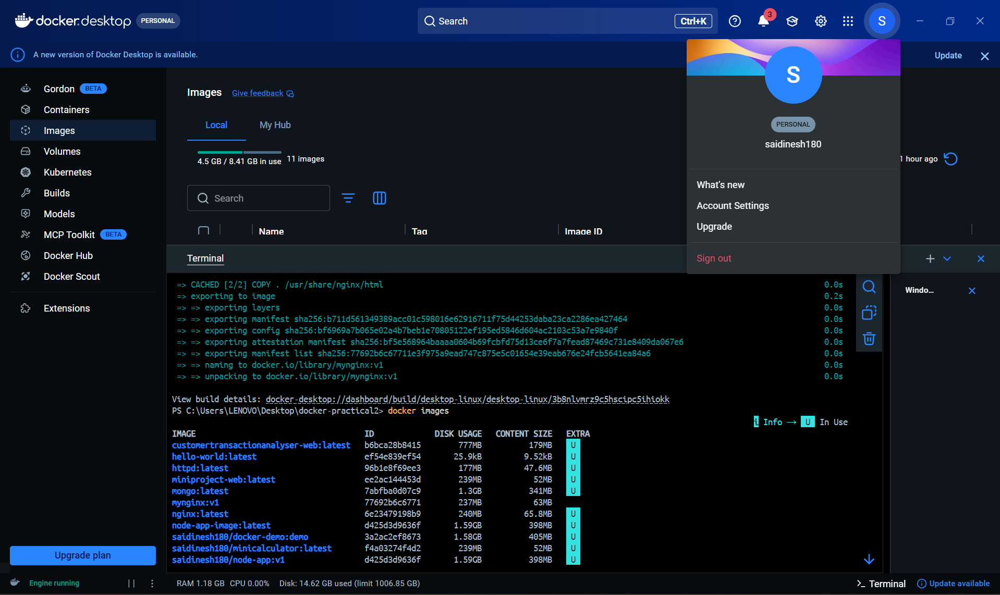
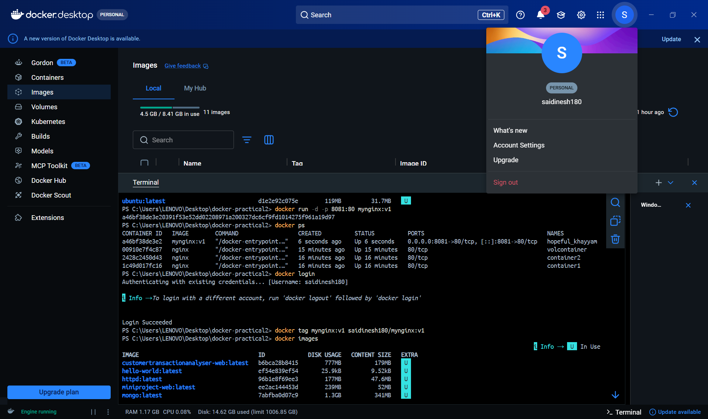
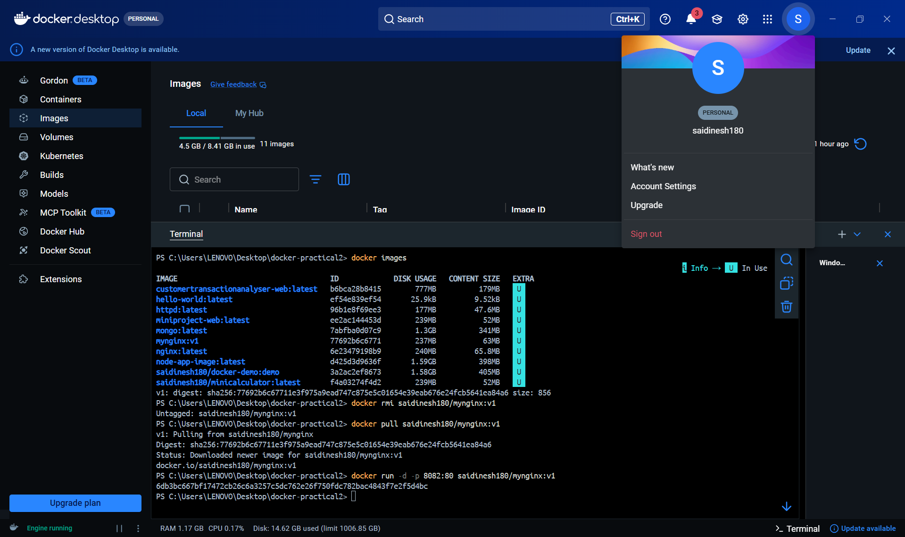
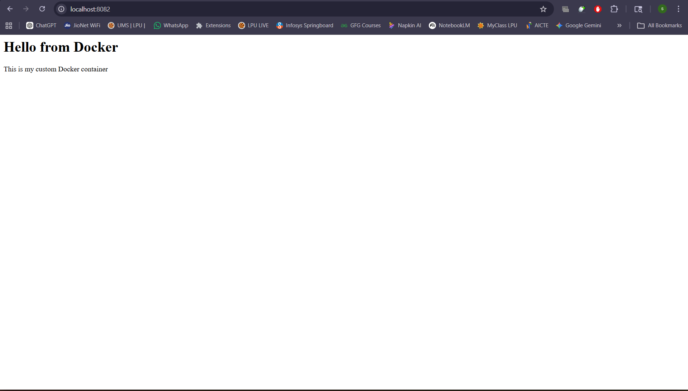

# 🔧 Practical 4 – Docker Hub Integration (Push & Pull Images)

---

## 🎯 Objective

To push a Docker image to Docker Hub and pull it back for reuse, demonstrating image distribution and version management.

---

## 🧠 Concepts Covered

* Docker Registry
* Image Tagging
* Docker Hub Authentication
* Image Push and Pull

---


## 🧪 Commands Used

### 🔹 Login to Docker Hub

```bash id="p4a1"
docker login
```

---

### 🔹 Tag Local Image

```bash id="p4a2"
docker tag mynginx:v1 <your-username>/mynginx:v1
```

---

### 🔹 Push Image to Docker Hub

```bash id="p4a3"
docker push <your-username>/mynginx:v1
```

---

### 🔹 List Local Images

```bash id="p4a4"
docker images
```

---

### 🔹 Remove Local Image (Optional Test)

```bash id="p4a5"
docker rmi <your-username>/mynginx:v1
```

---

### 🔹 Pull Image from Docker Hub

```bash id="p4a6"
docker pull <your-username>/mynginx:v1
```

---

### 🔹 Run Container from Pulled Image

```bash id="p4a7"
docker run -d -p 8082:80 <your-username>/mynginx:v1
```

---

## 📷 Execution Screenshots

### 1️⃣ Docker Login Successful



---

### 2️⃣ Image Tagging



---

### 3️⃣ Image Push to Docker Hub



---

### 4️⃣ Docker Hub Repository View



---

### 5️⃣ Image Pull from Docker Hub


---

### 6️⃣ Running Container from Pulled Image



---

## 📌 Expected Output

* Successful login to Docker Hub
* Image tagged with username
* Image pushed to Docker Hub repository
* Image visible on Docker Hub website
* Image pulled successfully on system
* Container runs from pulled image

---

## 🧠 Conclusion

Docker Hub acts as a central registry for storing and sharing container images. By tagging and pushing images, developers can distribute applications efficiently. Pulling images ensures consistency across environments, making Docker essential for modern DevOps workflows and CI/CD pipelines.

---
