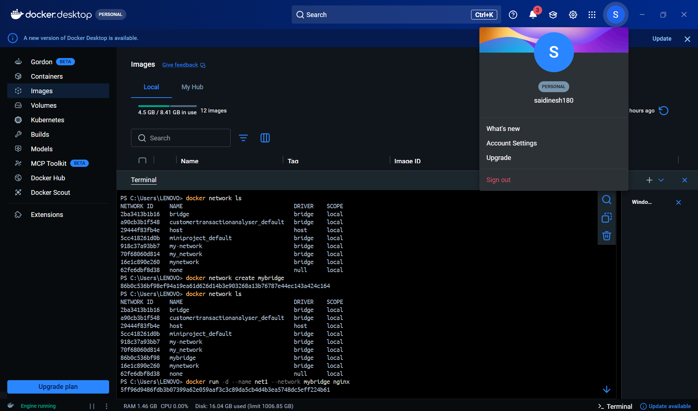
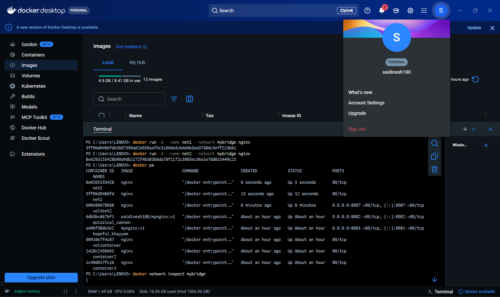
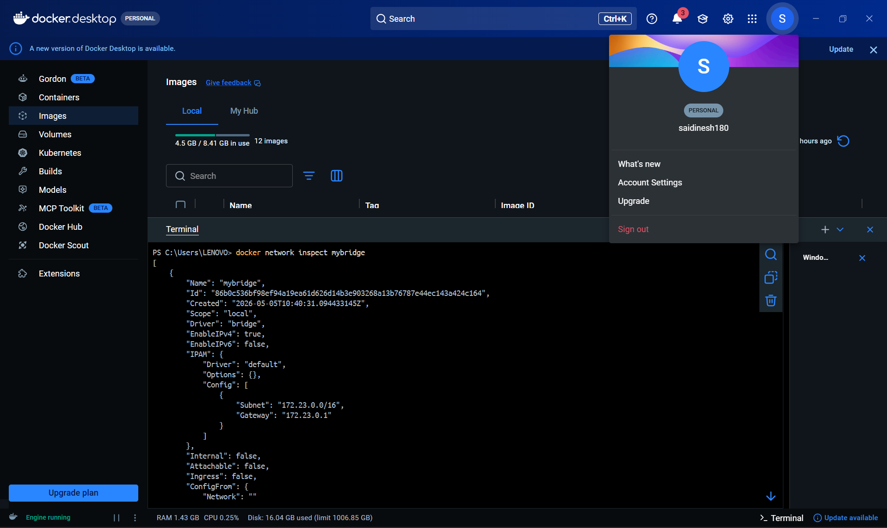
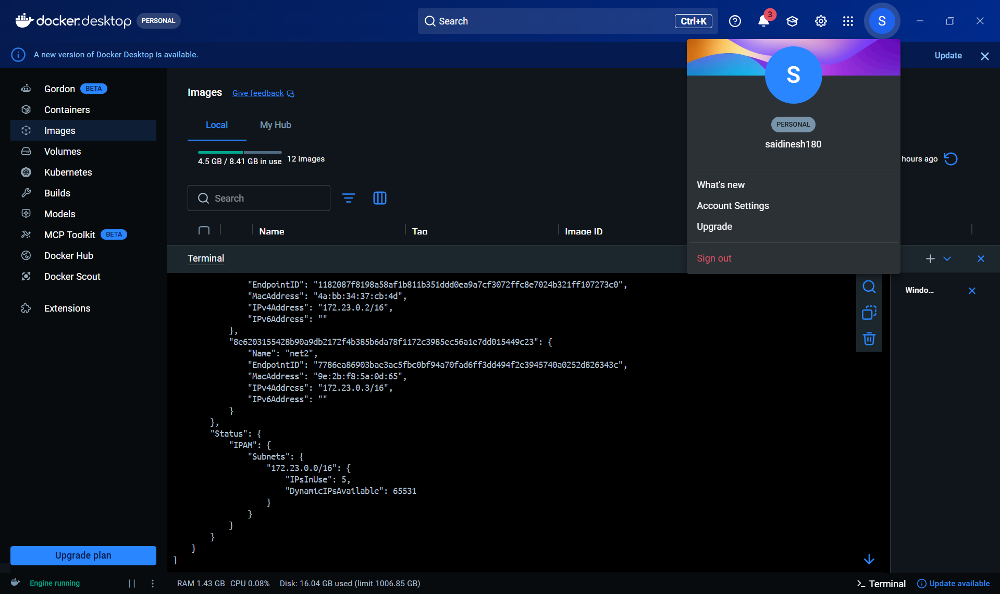
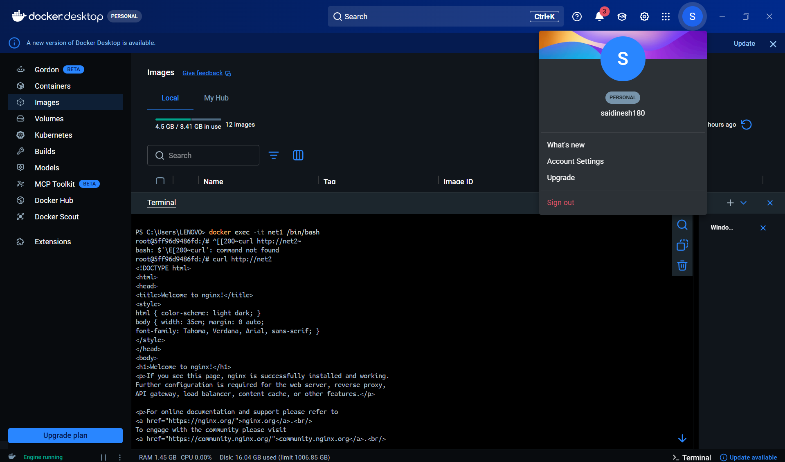
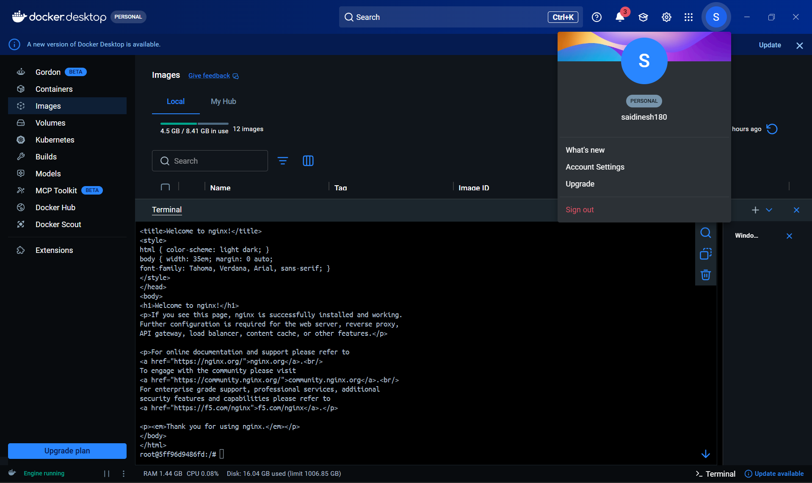

# 🔧 Practical 7 – Docker Networking and Container Communication

---

## 🎯 Objective

To create a custom Docker network and verify communication between containers using application-level tools.

---

## 🧠 Concepts Covered

* Docker Bridge Network
* Custom Network Creation
* Container-to-Container Communication
* DNS Resolution in Docker
* Application-level connectivity testing

---


## 🧪 Commands Used

### 🔹 List Existing Networks

```bash id="p7a1"
docker network ls
```

---

### 🔹 Create Custom Network

```bash id="p7a2"
docker network create mybridge
```

---

### 🔹 Run First Container in Network

```bash id="p7a3"
docker run -d --name net1 --network mybridge nginx
```

---

### 🔹 Run Second Container in Network

```bash id="p7a4"
docker run -d --name net2 --network mybridge nginx
```

---

### 🔹 Verify Running Containers

```bash id="p7a5"
docker ps
```

---

### 🔹 Inspect Network

```bash id="p7a6"
docker network inspect mybridge
```

---

### 🔹 Access Container Shell

```bash id="p7a7"
docker exec -it net1 /bin/bash
```

---

### 🔹 Install curl (inside container)

```bash id="p7a8"
apt update
apt install curl -y
```

---

### 🔹 Test Communication Using HTTP Request

```bash id="p7a9"
curl http://net2
```

---

### 🔹 Run Container with Port Mapping

```bash id="p7a10"
docker run -d -p 8088:80 nginx
```

---

### 🔹 Stop and Remove Containers

```bash id="p7a11"
docker stop net1 net2
docker rm net1 net2
docker network rm mybridge
```

---

## 📷 Execution Screenshots

### 1️⃣ Docker Network List



---

### 2️⃣ Custom Network Creation



---

### 3️⃣ Running Containers



---

### 4️⃣ Network Inspection



---

### 5️⃣ Container Communication using curl



---

### 6️⃣ Browser Output (Port Mapping)



---

### 7️⃣ Cleanup Process


---

## 📌 Expected Output

* Custom network successfully created
* Containers connected within same network
* Network inspection shows container details
* Container communication verified using HTTP request
* Nginx service accessible via browser using port mapping

---

## 🧠 Conclusion

Docker networking enables seamless communication between containers within an isolated environment. By using application-level tools like `curl`, container connectivity can be verified more effectively than traditional network-level tools. This approach reflects real-world DevOps practices where service communication is validated through application protocols.

---
